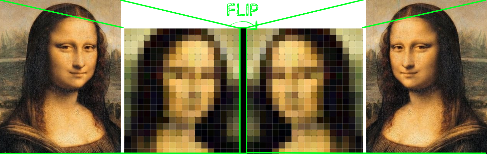
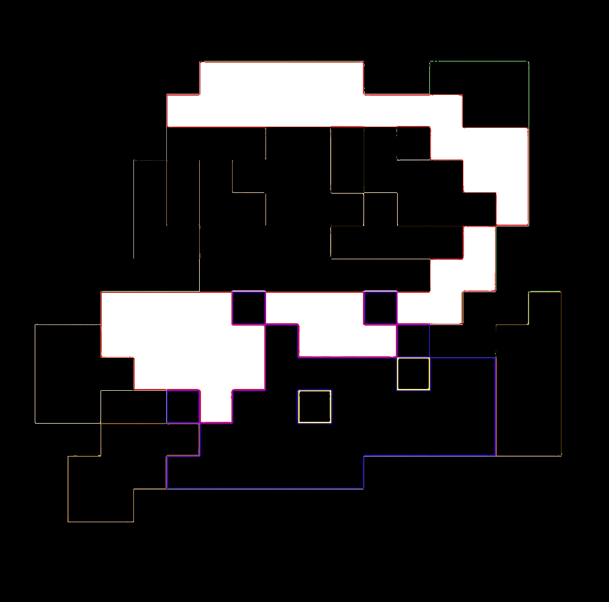

CLOAK OF INVISIBILITY
=======================


<div style="text-align: right"> Aka, the inverse green screen. </div>
&nbsp

Oi! Have you been waiting for your Hogwarts letter for a little too long? Well, no point in sitting steady waiting for magic to come to you; time to make some magic yourself via science -- *computer* science. So open up a `.py` file of your own naming or a [Jupyter](https://jupyter.org/) notebook.

For this, we will be using the infamous computer vision library, [OpenCV](https://opencv.org/), linear algebra's ally in the world of computer science, [NumPy](https://numpy.org/), and good ol' [Python](https://www.python.org/).

```python
import cv2 #OpenCv
import time #Python's time module: https://docs.python.org/3/library/time.html
import numpy as np #NumPy
```

The game plan is as follows:
0. Read in visual from your camera.
1. Extract a background frame to use as reference for replacing our cloak with the background.
2. Next, in each frame, we will detect and replace the pixels of the cloak with the corresponding ones from the background using color detection and a segmentation algorithm.
4. Lastly, replace the detected cloak with the original background from the reference frame.

#### I. Reading in visual from our camera.

OpenCV provides a simple interface for capturing live stream using a camera.

Let's create a [VideoCapture](https://docs.opencv.org/3.4/d8/dfe/classcv_1_1VideoCapture.html) object, where the argument passed in is the index of the camera (if you have only a single camera connected, pass in 0, since we programmers like the number 0 and to show our respect for it, begin our count from it):

```python
video_capture = cv2.VideoCapture(0)
```

Now, the key idea in inverse green screen is to replace the pixels corresponding to the chosen color in the current frame with the pixels from the same spot from the background, or **base**, image. In order to obtain our base frame, call [`.read()`](https://docs.opencv.org/3.4/d8/dfe/classcv_1_1VideoCapture.html#a473055e77dd7faa4d26d686226b292c1) on our VideoCapture object to retrieve the last frame.

```python
for i in range(60):
    ret, background = video_capture.read()
background = np.flip(background, axis=1)
```

`.read()` returns boolean `ret` to indicate whether it was able to successfully read and decode a frame, and a frame as a [numpy ndarray](https://docs.scipy.org/doc/numpy/reference/generated/numpy.ndarray.html) object, which we store in our `background` variable.

Note: We capture 60 frames, but why? In comparison to multiple frames image, an image captured from a single frame is a bit darker. Why? Because the camera is just getting started on capturing frames and hence its parameters are not stable yet. Averaging over multiple frames also reduces noise.

#### II. Frame by frame capture.

Now, let's process our video feed frame by frame.

```python
while (True): # While the camera is active
    ret, img = video_capture.read() # Read in a frame to img
```

##### Flip the image

We then flip the image left-to-right using the [`.flip`](https://docs.scipy.org/doc/numpy/reference/generated/numpy.flip.html) command from NumPy libary.

```python
img = np.flip(img, axis=1)
```

Just think of an image as a matrix of pixels...

 [5]

##### RBG -> HSV

Note that, by default, the `VideoCapture` object will convert the frame to the RGB (Red-Green-Blue) color space [1]. However, we want to work in HSV color-space because RBG values are highly sensitive to illumination and we want to maximize robustness of our algorithm to deal with varying lighting conditions.

Some quick notes on HSV (Hue-Saturation-Value):

 [4]

**Hue** determines the color, expressed in HSV color space as an angle of rotation from 0&deg; to 360&deg;:
- Red ∈ {0&deg;, 60&deg;}
- Yellow ∈ {61&deg;, 120&deg;}
- Green ∈ {121&deg;, 180&deg;}
- Cyan ∈ {181&deg;, 240&deg;}
- Blue ∈ {241&deg;, 300&deg;}
- Magenta ∈ {301&deg;, 360&deg;} [3]

**Saturation** describes the intensity of a hue  ∈ [0%, 100%]. Reducing this component toward zero introduces more grey and mutes the color.

**Value** determines the color's lightness (100%) or darkness (0%).

To convert from RGB -> HSV, we use the OpenCV function [`cv2.cvtColor(input_image, flag=cv2.COLOR_BGR2HSV)`](https://opencv-python-tutroals.readthedocs.io/en/latest/py_tutorials/py_imgproc/py_colorspaces/py_colorspaces.html) :

```python
hsv = cv2.cvtColor(img, cv2.COLOR_BGR2HSV)
```

#### Generate a binary mask to detect our cloak.

Next, we want to generate a mask based on the color of our invisibility cloak.

Since we are in the HSV color space and want to detect the color red, this translates to:

| Parameter  | Value | Reason
| ------------- | ------------- | ----- |
| **H**ue  | 0 - 30  | In OpenCV, we work with 8 bits so the hue ∈ [0, 179] to fit [6]. In 360&deg; range, red is between 0&deg; and 60&deg; -> divide by 2 to get the range in 180&deg; range = [0, 30].
| **S**aturation  | Content Cell  |
| **V**alue | 50 - 255 | *50* reaches to capture red in the wrinkles of our cloak and *255* in the bright light.

```python
lower_red = np.array([0, 125, 50])
upper_red = np.array([30, 255, 255])
mask1 = cv2.inRange(hsv, lower_red, upper_red)
```

The `inRange()` function simply returns a binary mask, where white pixels (255) represent pixels that fall into the upper and lower limit range and black pixels (0) do not. In our case, the white pixels (255) will represent red pixels and black pixels (0) will represent all other colors.

Original             |  Mask
:-------------------------:|:-------------------------:
   |  

[Image source 7]

If your cloak is not pure red, but say, has a pinkish tint to it, you might want to also loop in a magenta mask:

```python
lower_red = np.array([150, 120, 70])
upper_red = np.array([180, 255, 255])
mask2 = cv2.inRange(hsv, lower_red, upper_red)
```   

And combine the two masks using a `+` operator. It is basically doing an OR operation pixel-wise.

```python
mask1 = mask1 + mask2
```

Next, we want to perform a few [morphological operations](https://en.wikipedia.org/wiki/Mathematical_morphology).

First, let's perform an *opening* operation to remove noise.


**Opening** is a combination of *erosion* and *dilation*:

<p align="center">morph_opening(src, element) = dilate(erode(src,element))</p>

```python
mask1 = cv2.morphologyEx(mask1, cv2.MORPH_OPEN, np.ones((3,3), np.uint8))
```

**Erosion** removes (white) noise at the boundaries of the foreground (white) object. Under the hood, a (3,3) kernel slides over the 2D image and at any time if any pixels under the kernel are black (0), the original pixel will be eroded (set to 0); else, will be set to 1.

Original             |  Eroded
:-------------------------:|:-------------------------:
   |  

**Dilation** is the opposite of erosion: if any pixel under the kernel is white (1), the original pixel element is 1. Now that the white noise is gone, we can *dilate* our foreground image back to its original size, and potentially, join any broken parts.

Original             |  Dilated
:-------------------------:|:-------------------------:
   |  

```
mask1 = cv2.morphologyEx(mask1, cv2.MORPH_DILATE, np.ones((3,3), np.uint8))
```

We then invert our mask to segment out the red color from the frame using bitwise **not**.

```python
mask2 = cv2.bitwise_not(mask1)
```

Lastly, we will replace any detected red colored pixels with the value of the corresponding pixel values of our *base* background frame to create an invisibility cloak.

We will use bitwise **and** to segment out the red colored pixels from the frame using the inverted mask:

```python
res1 = cv2.bitwise_and(img, img, mask=mask2)
```

And segment out the pixels for the red colored pixels from the *base* background frame:

```python
res2 = cv2.bitwise_and(background, background, mask=mask1)
```

Combining the two to generate a frame where the pixels of the cloak were replaced with their corresponding pixel values from the *base* background frame:

```python
final_output = cv2.addWeighted(res1, 1, res2, 1, 0)
// Display the frame in window 'invisibility_cloak'
cv2.imshow('invisibility_cloak', final_output)
```

Afterwards, remember to clean up!

1. Release the camera by calling the `.release()` method on our VideoCapture object.
2. Destroy the windows by calling the `.destroyAllWindows()` function.


```python
video_capture.release()
cv2.destroyAllWindows()
```  

ADDITIONAL IMPROVEMENTS: ADD ALG TO EXRACT COLOR FROM IMAGE TO GET INTO HSV FOR ADDING ANY CLOAK COLOR WITHOUT MEDDLING WITH CODE

[1] http://answers.opencv.org/question/120277/default-color-space-for-frames-in-video/

[2] https://medium.com/@soumyapatil031/invisible-cloak-using-opencv-8f4acdf21290

[3] https://www.lifewire.com/what-is-hsv-in-design-1078068

[4] https://upload.wikimedia.org/wikipedia/commons/f/f2/HSV_color_solid_cone.png, SharkD / CC BY-SA (https://creativecommons.org/licenses/by-sa/3.0)

[5] https://www.alchemylivinginc.com/ixxi-mona-lisa-pixelated.html

[6] https://docs.opencv.org/3.2.0/df/d9d/tutorial_py_colorspaces.html

[7] https://ih0.redbubble.net/image.39047923.0157/flat,1000x1000,075,f.jpg

[8] https://docs.opencv.org/trunk/d9/d61/tutorial_py_morphological_ops.html
